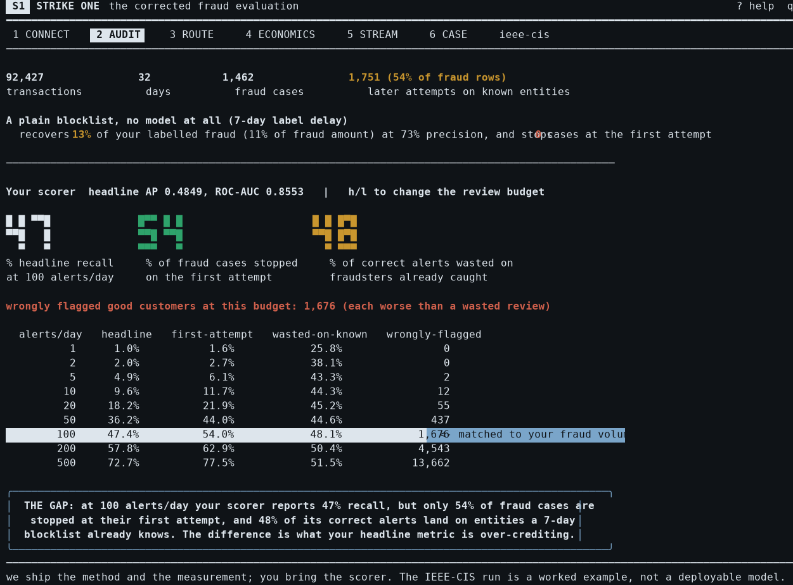

<div align="center">

# Strike One

**One command that tells you how much of your fraud metric is
re-catching fraudsters it already knew about.**


</div>

Fraud labels propagate: once a fraudster is confirmed, all their later
attempts get labelled fraud too. Standard metrics credit a model for
re-catching them, alerts a standing blocklist would also have covered.
Strike One measures that gap on **your** data, with **your** model.

- `strikeone audit` - your headline metric vs fraud cases caught at their
  **first labelled transaction**, blocklist-coverable alerts, and what a blocklist gets you free
- `strikeone route` - wrap the scorer you already run with a blocklist
  lane, and measure the lift (or learn it would not help, honestly)
- `strikeone policy` - your costs in, approve / verify / block out
- `strikeone tui` - all of it as a terminal app

Bring your own scorer. **Your data never leaves the machine**: no
telemetry, no network calls, anywhere.

## Install

```bash
git clone https://github.com/Thebinary110/Strike-One && cd Strike-One
pip install -e .          # or: uv sync
```

The TUI additionally needs Node 18+: `cd tui && npm install && npx tsc`.

## Try it in 30 seconds

```bash
strikeone audit --example synthetic    # instant, generated demo data
```

With the worked example built (see `FINDINGS.md` for the full study),
`strikeone audit --example ieee-cis` prints, verbatim:

```text
STRIKE ONE  fraud-operation audit
──────────────────────────────────────────────────────────────────────────
WHAT WAS READ
  92,427 transactions over 32.0 days (relative timestamps)
  3,213 labelled fraud (3.48%); no rows were dropped
  the entity key resolves cleanly on 89.5% of rows; the rest pool into
  coarser identities, so every case count below leans conservative
  fraud labels assumed knowable 7 days after the transaction

THE NUMBER YOU ALREADY HAVE
  average precision 0.4849, ROC-AUC 0.8553
  at a stated default of 100 reviews/day
  (pass --capacity with your real number):
  47% of fraud transactions caught, 1,676 good customers flagged

THE NUMBER NOBODY HAS
  54.0% of fraud CASES stopped on the very first attempt
  at those same 100 reviews/day. That is the only moment a loss
  is prevented; everything after it, a blocklist catches for free.

WHERE YOUR ALERTS WENT
  of 3,199 alerts spent:
     790  stopped a fraud case at its first attempt: the only alerts
          that prevented a loss
     733  were later attempts in cases that had already begun
          (48% of your correct alerts); a blocklist catches these
          for free
   1,676  flagged good customers

WHAT A BLOCKLIST GETS YOU FOR FREE
  a plain blocklist, no model, recovers 12.9% of your labelled fraud
  by flagging 566 transactions at 73.0% precision, with 0 first-attempt stops.
  At the same 566 alerts your scorer reaches 92.9% precision and stops
  283 cases first-attempt. Respectable precision, zero prevention:
  precision without prevention is exactly what it sells.

ONE THING TO DO NEXT
  about 23 of your 100 reviews/day went to cases that had already
  begun. How many of those a blocklist lane actually recovers depends on
  your 7-day label maturity. Measure it: strikeone route <your file>

AT OTHER REVIEW BUDGETS
  reviews/day txns caught stopped 1st blocklist-coverable good flagged
            1        1.0%        1.6%           25.8%            0
            2        2.0%        2.7%           38.1%            0
            5        4.9%        6.1%           43.3%            2
           10        9.6%       11.7%           44.3%           12
           20       18.2%       21.9%           45.2%           55
           50       36.2%       44.0%           44.6%          437
          100       47.4%       54.0%           48.1%        1,676 <-capacity
          200       57.8%       62.9%           50.4%        4,543
          500       72.7%       77.5%           51.5%       13,662

──────────────────────────────────────────────────────────────────────────
ASSUMED, NOT MEASURED
  cases are bounded by this file. Any fraudster already active before it
  starts counts here as a first attempt, so first-attempt stops are an
  upper bound. A longer window, or --history, tightens it.
  Fraud labels mature in 7 days here; slower maturity shrinks
  every blocklist figure above. Case boundaries come from your entity key;
  a coarser or finer key moves them. This audit evaluates only the score
  column you provided: no other model was applied to your traffic, and
  nothing about your data left this machine.
```

The command also prints why these numbers legitimately differ from the
frozen study reports (different scorer configuration, window-local case
boundaries, alert arithmetic).

## Use it on your data - no code

Map your columns once, then every command works:

```bash
strikeone check  yourdata.parquet \
  --map transaction_id=txn_id --map timestamp=created_at \
  --map amount=amount --map entity=card_hash+email_hash \
  --map label=is_chargeback --delay 30 --save-config
strikeone audit  yourdata.parquet --capacity 50
```

| you need | what it is |
|---|---|
| `transaction_id` | one row = one transaction |
| `timestamp` | epoch seconds or ISO datetimes |
| `amount` | transaction amount |
| `entity` | who it belongs to (one or more columns, `a+b`) |
| `label` | 1 = confirmed fraud/chargeback, plus `--delay` (days until known) |
| `score` *(optional)* | your model's output |
| `p` *(optional)* | calibrated probability, only for `policy` |

Useful flags: `--capacity` (your real reviews/day) · `--history file`
(entities flagged before this window, tightens first-attempt counts from
upper bound to measured) · `--json` (pipe anywhere, CI-friendly).
Readers: parquet, CSV, or a database URL. Worked mappings, including a
PSP-shaped disputes export: [`examples/`](examples/).

## The terminal UI

```bash
strikeone tui --help          # usage + all keys
strikeone tui --example ieee-cis
```



Six panels (CONNECT, AUDIT, ROUTE, ECONOMICS, STREAM, CASE), fully
keyboard-driven, runs offline over stdio to the local Python core.

## How it works

1. Your rows are sorted chronologically; a fraud **case** is one
   entity's run of fraud, and only its **first labelled transaction** was ever
   catchable before the entity was known.
2. A point-in-time blocklist is simulated from your labels and your
   stated label delay: what a lookup table would already have known.
3. Every alert your scorer would raise, at your review capacity, is
   classified: first-hit catch, later attempt (blocklist-coverable),
   or flagged good customer.
4. All comparisons are budget-matched; nothing is compared at different
   alert counts.

## Honest by design

- The included IEEE-CIS run is a **worked example, not a deployable
  model**; nothing here applies our weights to your traffic.
- Every output states its assumptions and its blind spots (label
  maturity, entity-key resolution, window truncation) next to the
  numbers, and `check` refuses data it cannot audit correctly.
- The study behind the method: a sealed holdout opened exactly once
  against a pre-registered plan, self-caught bugs documented, negative
  results published. Read [`FINDINGS.md`](FINDINGS.md) and
  [`reports/`](reports/).

## Data and license

The worked example uses the public IEEE-CIS dataset (Vesta / Kaggle
2019); nothing from it is committed to this repo - scripts download and
checksum-verify it. Fonts in the TUI-adjacent extras are Fontshare
(ITF FFL, licences committed). Code: Apache-2.0.
